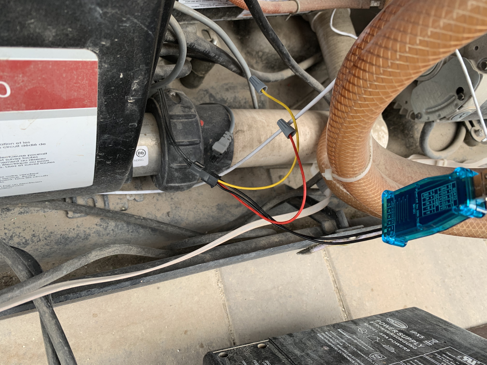

## Using RS-485 for a direct connection

This gem supports using an RS-485 direct connection to the hot tub if you don't have the Wifi module, or would simply like something more reliable. It is possible to directly connect to the GPIO on a Raspberry Pi, or to use a USB RS-485 dongle such as [this one from Amazon](https://www.amazon.com/gp/product/B07B416CPK). The key is identifying the correct wires as RS-485+ and RS-485-. There should be a small connector coming out of your control box. It's compatible with an [ATX micro-fit connector](https://www.amazon.com/gp/product/B07Z7X5KW1). You can also purchase a Y-cable such as [this one](https://spacare.com/BalboaWaterGroupWi-FiY-CableSplitter25657.aspx) if you already have something connected to the port, and want to keep it connected (or spy on its communication). Note that the colors may not be the same on any adapter or pigtail you find. Here's a photo of mine connected to the dongle:

As you can see in my case, the two black wires ended up being RS-485. The surefire way to test is to break out a multimeter and compare pairs of wires. One set of opposite pins should show 12-14V. Once you've found that keep one probe on the negative end, and try the other two wires. They should both read 2-3V. The slightly higher one will be RS-485+, and the slightly lower one will be RS-485-. You don't have to fret too much on getting them right (as long as you don't hook up the +12V line!) - you'll just get garbage if you swap + and -. Swap them back and you should be good. Here's a closer view of the header where you can see that the black wires (RS-485) are top-left and bottom-right when viewed looking into the connector, with the latch on the left.

## Related Projects

These projects are all in various states, and may be more or less developed than this one in varying aspects.

 * https://github.com/rsrawley/spaControl - Node.js server with socket.io API and other customizations
 * https://github.com/garbled1/pybalboa/ - Python library
 * https://github.com/plmilord/Hass.io-custom-component-spaclient = Hass.io integration
 * https://github.com/MHotchin/BalboaSpaComms - C++/Windows

## Thanks

 * @garbled1 for figuring out the checksums
 * @rsrawley for [details on connecting RS-485](https://docs.google.com/document/d/1s4A0paeGc89k6Try2g3ok8V9BcYm5CXhDr1ys0qUT4s/edit?usp=drivesdk&authuser=0) and his [javascript code](https://github.com/rsrawley/spaControl) that decoded a few of the local bus only messages, and the insight that you can only send messages when the controller is ready in that mode.